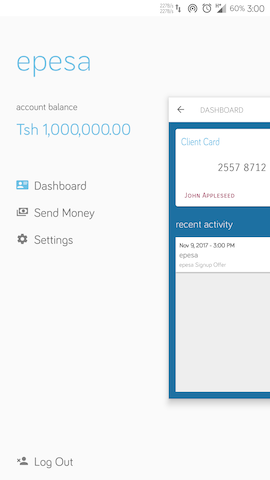

# epesa - an e-wallet application

epesa was developed as a potential startup, an e-wallet for Africa's bankless society.  Due to circumstances that prevented epesa's eventual launch, the project was made open source.

This is the Android app for epesa.

This is a fully functional Android app that allows to create users and transfer money amongst them.  It supports features such as Passcode authentication on launch/resume, Push Notifications support, local encrypted data persistence, and personalized QR Code generation.  It is written in Java.  The data is persisted locally as encrypted SharedPreferences and local Internal Storage.  Libraries of note in this project include Retrofit2, Butterknife, Realm, EventBus, Joda-Time, and Flubber Animation Library.

## To use this project:

You may use this project for your own (personal and NON-COMMERCIAL) use.  To do so, you will need to edit the value of ```BASE_URL``` in file ```Utils.java``` to the URL of the host where you are running a copy of epesa-js (available as another repo).

## Screenshots

  
  
  
  
  